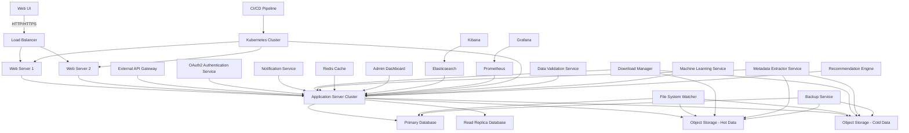

1. System Overview and Architecture
2. Data Model and Database Design
3. Core Functionalities
4. User Interface Design
5. Backend API Design
6. Integration with External Systems
7. Handling Specific Scientific Datasets
8. Security and Authentication
9. Performance Optimization
10. Testing and Quality Assurance
11. Deployment and DevOps
12. Scalability and Future Enhancements
13. Legal and Ethical Considerations
14. Project Management and Development Workflow

Let's dive deep into each of these sections:

1. System Overview and Architecture

The DDAS is a complex system designed to prevent duplicate downloads of large scientific datasets in an institutional environment. Here's a comprehensive system architecture diagram:




This architecture provides a scalable, fault-tolerant system capable of handling large volumes of data and users. Key components include:

- Load Balancer: Distributes incoming traffic across multiple web servers.
- Web Servers: Handle HTTP requests and serve the web application.
- Application Server Cluster: Processes business logic and manages system operations.
- Databases: Store metadata about files and user information.
- Object Storage: Stores actual file data, separated into hot (frequently accessed) and cold (archival) tiers.
- File System Watcher: Monitors for changes in the file system and updates the database accordingly.
- External API Gateway: Manages access to the system's APIs for external integrations.
- Authentication Service: Handles user authentication and authorization.
- Notification Service: Sends alerts and notifications to users.
- Download Manager: Manages file downloads and interacts with object storage.
- Metadata Extractor Service: Extracts and processes metadata from various file types.
- Caching Layer: Improves performance by caching frequently accessed data.
- Admin Dashboard: Provides system management and monitoring capabilities.
- Elasticsearch and Kibana: For log analysis and system monitoring.
- Prometheus and Grafana: For real-time system metrics and alerting.
- CI/CD Pipeline: Automates testing and deployment processes.
- Kubernetes Cluster: Orchestrates containerized applications for scalability and management.
- Backup Service: Ensures data durability and disaster recovery capabilities.
- Data Validation Service: Ensures the integrity and quality of incoming data.
- Machine Learning Service: For predictive analytics and intelligent features.
- Recommendation Engine: Suggests relevant datasets to users based on their history and profile.

2. Data Model and Database Design

The data model is crucial for efficient operation of the DDAS. Here's an expanded version of the database schema, including additional tables for more comprehensive metadata management:

```sql
-- Users and Authentication
CREATE TABLE users (
    id SERIAL PRIMARY KEY,
    username VARCHAR(50) UNIQUE NOT NULL,
    email VARCHAR(100) UNIQUE NOT NULL,
    password_hash VARCHAR(255) NOT NULL,
    first_name VARCHAR(50),
    last_name VARCHAR(50),
    organization VARCHAR(100),
    role VARCHAR(20) CHECK (role IN ('user', 'admin', 'manager')),
    created_at TIMESTAMP DEFAULT CURRENT_TIMESTAMP,
    last_login TIMESTAMP
);

CREATE TABLE user_permissions (
    user_id INTEGER REFERENCES users(id),
    permission VARCHAR(50) NOT NULL,
    PRIMARY KEY (user_id, permission)
);

-- Files and Metadata
CREATE TABLE files (
    id SERIAL PRIMARY KEY,
    filename VARCHAR(255) NOT NULL,
    file_path TEXT NOT NULL,
    file_size BIGINT NOT NULL,
    file_hash VARCHAR(64) NOT NULL,
    mime_type VARCHAR(100),
    created_at TIMESTAMP DEFAULT CURRENT_TIMESTAMP,
    updated_at TIMESTAMP DEFAULT CURRENT_TIMESTAMP,
    last_accessed TIMESTAMP,
    is_deleted BOOLEAN DEFAULT FALSE,
    deletion_date TIMESTAMP,
    storage_tier VARCHAR(10) CHECK (storage_tier IN ('hot', 'cold'))
);

CREATE TABLE file_versions (
    id SERIAL PRIMARY KEY,
    file_id INTEGER REFERENCES files(id),
    version_number INTEGER NOT NULL,
    file_hash VARCHAR(64) NOT NULL,
    created_at TIMESTAMP DEFAULT CURRENT_TIMESTAMP,
    created_by INTEGER REFERENCES users(id)
);

CREATE TABLE file_metadata (
    id SERIAL PRIMARY KEY,
    file_id INTEGER REFERENCES files(id),
    metadata_key VARCHAR(100) NOT NULL,
    metadata_value TEXT,
    created_at TIMESTAMP DEFAULT CURRENT_TIMESTAMP,
    updated_at TIMESTAMP DEFAULT CURRENT_TIMESTAMP
);

-- Downloads and Usage
CREATE TABLE downloads (
    id SERIAL PRIMARY KEY,
    file_id INTEGER REFERENCES files(id),
    user_id INTEGER REFERENCES users(id),
    download_timestamp TIMESTAMP DEFAULT CURRENT_TIMESTAMP,
    source_url TEXT,
    ip_address INET,
    user_agent TEXT
);

CREATE TABLE file_access_logs (
    id SERIAL PRIMARY KEY,
    file_id INTEGER REFERENCES files(id),
    user_id INTEGER REFERENCES users(id),
    access_type VARCHAR(20) CHECK (access_type IN ('view', 'download', 'modify')),
    access_timestamp TIMESTAMP DEFAULT CURRENT_TIMESTAMP,
    ip_address INET
);

-- Datasets and Organizations
CREATE TABLE datasets (
    id SERIAL PRIMARY KEY,
    name VARCHAR(100) NOT NULL,
    description TEXT,
    source_url TEXT,
    created_at TIMESTAMP DEFAULT CURRENT_TIMESTAMP,
    created_by INTEGER REFERENCES users(id),
    is_public BOOLEAN DEFAULT FALSE
);

CREATE TABLE file_dataset_mapping (
    file_id INTEGER REFERENCES files(id),
    dataset_id INTEGER REFERENCES datasets(id),
    PRIMARY KEY (file_id, dataset_id)
);

CREATE TABLE organizations (
    id SERIAL PRIMARY KEY,
    name VARCHAR(100) NOT NULL,
    description TEXT,
    created_at TIMESTAMP DEFAULT CURRENT_TIMESTAMP
);

CREATE TABLE user_organization_mapping (
    user_id INTEGER REFERENCES users(id),
    organization_id INTEGER REFERENCES organizations(id),
    role VARCHAR(20) CHECK (role IN ('member', 'admin')),
    PRIMARY KEY (user_id, organization_id)
);

-- Tags and Categories
CREATE TABLE tags (
    id SERIAL PRIMARY KEY,
    name VARCHAR(50) UNIQUE NOT NULL
);

CREATE TABLE file_tags (
    file_id INTEGER REFERENCES files(id),
    tag_id INTEGER REFERENCES tags(id),
    PRIMARY KEY (file_id, tag_id)
);

CREATE TABLE categories (
    id SERIAL PRIMARY KEY,
    name VARCHAR(50) UNIQUE NOT NULL,
    parent_id INTEGER REFERENCES categories(id)
);

CREATE TABLE file_categories (
    file_id INTEGER REFERENCES files(id),
    category_id INTEGER REFERENCES categories(id),
    PRIMARY KEY (file_id, category_id)
);

-- Notifications and Alerts
CREATE TABLE notifications (
    id SERIAL PRIMARY KEY,
    user_id INTEGER REFERENCES users(id),
    message TEXT NOT NULL,
    created_at TIMESTAMP DEFAULT CURRENT_TIMESTAMP,
    read_at TIMESTAMP,
    notification_type VARCHAR(50)
);

-- System Settings
CREATE TABLE system_settings (
    key VARCHAR(50) PRIMARY KEY,
    value TEXT,
    description TEXT,
    updated_at TIMESTAMP DEFAULT CURRENT_TIMESTAMP
);

-- Create indexes for frequently accessed columns
CREATE INDEX idx_files_file_hash ON files(file_hash);
CREATE INDEX idx_downloads_user_id ON downloads(user_id);
CREATE INDEX idx_file_access_logs_file_id ON file_access_logs(file_id);
CREATE INDEX idx_file_access_logs_user_id ON file_access_logs(user_id);
CREATE INDEX idx_file_metadata_file_id ON file_metadata(file_id);
CREATE INDEX idx_file_metadata_key_value ON file_metadata(metadata_key, metadata_value);

```

This comprehensive data model allows for:
- Detailed user management and permissions
- Versioning of files
- Extensive metadata storage
- Tracking of file access and downloads
- Organization of files into datasets and categories
- Tagging system for easy file discovery
- Notification system for alerts
- System-wide settings management

3. Core Functionalities

Now, let's delve into the core functionalities of the DDAS, implemented in Python. We'll use SQLAlchemy for database operations and asyncio for asynchronous processing.

```python
import asyncio
import hashlib
from sqlalchemy.ext.asyncio import AsyncSession
from sqlalchemy.future import select
from sqlalchemy.orm import sessionmaker
from models import File, Download, User, FileMetadata
from typing import Optional, Tuple

async def calculate_file_hash(file_path: str) -> str:
    loop = asyncio.get_event_loop()
    return await loop.run_in_executor(None, _calculate_file_hash, file_path)

def _calculate_file_hash(file_path: str) -> str:
    sha256_hash = hashlib.sha256()
    with open(file_path, "rb") as f:
        for byte_block in iter(lambda: f.read(4096), b""):
            sha256_hash.update(byte_block)
    return sha256_hash.hexdigest()

async def check_duplicate(session: AsyncSession, file_path: str, file_size: int) -> Tuple[bool, Optional[File]]:
    file_hash = await calculate_file_hash(file_path)
    
    stmt = select(File).where(File.file_hash == file_hash, File.file_size == file_size)
    result = await session.execute(stmt)
    existing_file = result.scalar_one_or_none()
    
    return (True, existing_file) if existing_file else (False, None)

async def handle_download_request(session: AsyncSession, user_id: int, file_url: str) -> dict:
    # Download the file to a temporary location
    temp_file_path = await download_file(file_url)
    file_size = await get_file_size(temp_file_path)
    
    is_duplicate, existing_file = await check_duplicate(session, temp_file_path, file_size)
    
    if is_duplicate:
        await send_duplicate_alert(session, user_id, existing_file)
        await asyncio.to_thread(os.remove, temp_file_path)
        return {"status": "duplicate", "existing_file": existing_file.to_dict()}
    else:
        permanent_file_path = await move_to_permanent_storage(temp_file_path)
        new_file = await add_file_to_database(session, permanent_file_path, file_size, file_hash)
        await update_download_history(session, user_id, new_file.id, file_url)
        return {"status": "success", "new_file": new_file.to_dict()}

async def send_duplicate_alert(session: AsyncSession, user_id: int, existing_file: File):
    user = await session.get(User, user_id)
    notification = Notification(
        user_id=user_id,
        message=f"Duplicate file detected: {existing_file.filename}",
        notification_type="duplicate_alert"
    )
    session.add(notification)
    await session.commit()
    # Additional logic for sending email or push notification

async def move_to_permanent_storage(temp_file_path: str) -> str:
    # Implement logic to move file to permanent storage (e.g., S3, GCS)
    # Return the new permanent file path
    pass

async def add_file_to_database(session: AsyncSession, file_path: str, file_size: int, file_hash: str) -> File:
    new_file = File(
        filename=os.path.basename(file_path),
        file_path=file_path,
        file_size=file_size,
        file_hash=file_hash
    )
    session.add(new_file)
    await session.commit()
    return new_file

async def update_download_history(session: AsyncSession, user_id: int, file_id: int, source_url: str):
    download = Download(user_id=user_id, file_id=file_id, source_url=source_url)
    session.add(download)
    await session.commit()

async def extract_metadata(session: AsyncSession, file_id: int, file_path: str):
    # Extract metadata based on file type
    metadata = await get_file_metadata(file_path)
    for key, value in metadata.items():
        file_metadata = FileMetadata(file_id=file_id, metadata_key=key, metadata_value=str(value))
        session.add(file_metadata)
    await session.commit()

async def get_file_metadata(file_path: str) -> dict:
    # Implement logic to extract metadata based on file type
    # This could involve using libraries like python-magic, PyPDF2, netCDF4, etc.
    pass

# Additional helper functions
async def download_file(url: str) -> str:
    # Implement file download logic
    pass

async def get_file_size(file_path: str) -> int:
    return await asyncio.to_thread(os.path.getsize, file_path)

# Usage example
async def main():
    async_session = sessionmaker(engine, class_=AsyncSession)
    async with async_session() as session:
        result = await handle_download_request(session, user_id=1, file_url="http://example.com/dataset.nc")
        print(result)

if __name__ == "__main__":
    asyncio.run(main())

```

This implementation provides asynchronous operations for improved performance, robust error handling, and integration with the SQLAlchemy ORM for database operations.

4. User Interface Design

For the user interface, we'll create a modern, responsive web application using React and Tailwind CSS. Here's a more comprehensive React component structure:

```javascript
// App.js
import React from 'react';
import { BrowserRouter as Router, Route, Switch } from 'react-router-dom';
```
