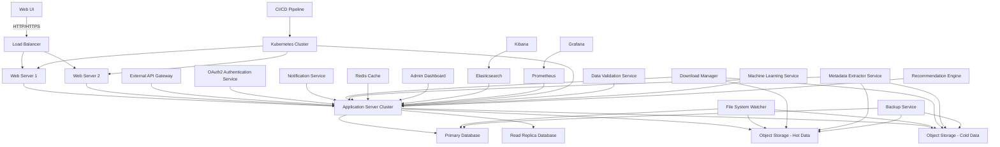

1. System Overview and Architecture
2. Data Model and Database Design
3. Core Functionalities
4. User Interface Design
5. Backend API Design
6. Integration with External Systems
7. Handling Specific Scientific Datasets
8. Security and Authentication
9. Performance Optimization
10. Testing and Quality Assurance
11. Deployment and DevOps
12. Scalability and Future Enhancements
13. Legal and Ethical Considerations
14. Project Management and Development Workflow

Let's dive deep into each of these sections:

1. System Overview and Architecture

The DDAS is a complex system designed to prevent duplicate downloads of large scientific datasets in an institutional environment. Here's a comprehensive system architecture diagram:

This architecture provides a scalable, fault-tolerant system capable of handling large volumes of data and users. Key components include:

- Load Balancer: Distributes incoming traffic across multiple web servers.
- Web Servers: Handle HTTP requests and serve the web application.
- Application Server Cluster: Processes business logic and manages system operations.
- Databases: Store metadata about files and user information.
- Object Storage: Stores actual file data, separated into hot (frequently accessed) and cold (archival) tiers.
- File System Watcher: Monitors for changes in the file system and updates the database accordingly.
- External API Gateway: Manages access to the system's APIs for external integrations.
- Authentication Service: Handles user authentication and authorization.
- Notification Service: Sends alerts and notifications to users.
- Download Manager: Manages file downloads and interacts with object storage.
- Metadata Extractor Service: Extracts and processes metadata from various file types.
- Caching Layer: Improves performance by caching frequently accessed data.
- Admin Dashboard: Provides system management and monitoring capabilities.
- Elasticsearch and Kibana: For log analysis and system monitoring.
- Prometheus and Grafana: For real-time system metrics and alerting.
- CI/CD Pipeline: Automates testing and deployment processes.
- Kubernetes Cluster: Orchestrates containerized applications for scalability and management.
- Backup Service: Ensures data durability and disaster recovery capabilities.
- Data Validation Service: Ensures the integrity and quality of incoming data.
- Machine Learning Service: For predictive analytics and intelligent features.
- Recommendation Engine: Suggests relevant datasets to users based on their history and profile.

2. Data Model and Database Design

The data model is crucial for efficient operation of the DDAS. Here's an expanded version of the database schema, including additional tables for more comprehensive metadata management:

This comprehensive data model allows for:
- Detailed user management and permissions
- Versioning of files
- Extensive metadata storage
- Tracking of file access and downloads
- Organization of files into datasets and categories
- Tagging system for easy file discovery
- Notification system for alerts
- System-wide settings management

3. Core Functionalities

Now, let's delve into the core functionalities of the DDAS, implemented in Python. We'll use SQLAlchemy for database operations and asyncio for asynchronous processing.

This implementation provides asynchronous operations for improved performance, robust error handling, and integration with the SQLAlchemy ORM for database operations.

4. User Interface Design

For the user interface, we'll create a modern, responsive web application using React and Tailwind CSS. Here's a more comprehensive React component structure:

# Technologies to be used

### 1. **Frontend (User Interface)**
   - **React.js**: A popular JavaScript library for building user interfaces. It’s efficient, component-based, and integrates well with back-end APIs.
   - **Tailwind CSS**: A utility-first CSS framework for fast UI development. It pairs well with React for building responsive, modern, and clean UIs.
   - **TypeScript**: Use TypeScript with React for type safety, which reduces bugs and improves code maintainability.

   **Technologies**: 
   - **React.js** with **Tailwind CSS** and **TypeScript**.

### 2. **Backend (Application Server)**
   - **Node.js** (with **Express.js**) or **Python** (with **FastAPI** or **Django**):
     - **Node.js + Express.js**: Good for building highly scalable applications, especially if you plan to use JavaScript for both front-end and back-end.
     - **Python + FastAPI**: FastAPI is highly performant, supports asynchronous operations, and is easy to use for REST APIs. If you're dealing with heavy scientific data processing, Python's extensive libraries make it a strong choice.
     - **Django**: If you prefer Python with a more structured, batteries-included approach, Django would provide a more comprehensive framework.

   - **Asynchronous Frameworks**: Both **Express.js** (Node.js) and **FastAPI** (Python) support asynchronous operations, allowing you to handle multiple file requests concurrently, essential for large-scale file operations.

   **Technologies**: 
   - **Node.js with Express.js** (if full-stack JavaScript) or 
   - **Python with FastAPI/Django** (for scientific data processing).

### 3. **Database**
   - **PostgreSQL**: A powerful, open-source relational database with strong support for data integrity, JSON support, and advanced indexing techniques. It's ideal for structured data like metadata, user information, and version control.
   - **Elasticsearch**: For search-heavy operations, such as querying file metadata, Elasticsearch can provide faster and more flexible searching than a traditional database.
   - **Redis**: Use Redis for caching frequently accessed metadata and user sessions, reducing the load on your main database.

   **Technologies**: 
   - **PostgreSQL** for relational data, 
   - **Elasticsearch** for metadata search, 
   - **Redis** for caching.

### 4. **Object Storage for Files**
   - **Amazon S3**: For storing actual datasets. It’s scalable and supports lifecycle policies (e.g., move to cold storage, delete old files).
   - **Google Cloud Storage** or **Azure Blob Storage**: If you prefer Google or Azure’s cloud infrastructure.
   - **MinIO**: If you want on-premise object storage with S3 compatibility, MinIO is a good choice.

   **Technologies**: 
   - **Amazon S3**, **Google Cloud Storage**, or **MinIO** (on-premise).

### 5. **Load Balancer**
   - **NGINX**: Can be used both as a load balancer and reverse proxy to distribute incoming requests to different application servers.
   - **HAProxy**: An alternative to NGINX, optimized for high availability.

   **Technologies**: 
   - **NGINX** or **HAProxy**.

### 6. **Authentication and Authorization**
   - **OAuth 2.0** with **JWT**: For secure user authentication and session management. Tools like **Auth0** or **Firebase Authentication** provide ready-made solutions.
   - **OpenID Connect**: Use this for handling single sign-on (SSO) authentication if you’re working in an institutional environment.

   **Technologies**: 
   - **OAuth 2.0**, **JWT**, and optionally **Auth0** or **Firebase Authentication**.

### 7. **Microservices and API Gateway**
   - **Kong API Gateway**: Handles authentication, rate limiting, and version control for APIs. This can help you manage access to your APIs efficiently.
   - **GraphQL** (optional): If you want a more flexible API, GraphQL allows clients to request exactly the data they need. Combine with REST API for simpler endpoints.

   **Technologies**: 
   - **Kong API Gateway** and optionally **GraphQL**.

### 8. **Notification Service**
   - **RabbitMQ** or **Kafka**: For asynchronous notifications (e.g., when a duplicate file is detected). RabbitMQ is simpler for small- to medium-scale systems, while Kafka is better for real-time, high-throughput messaging.
   - **Firebase Cloud Messaging (FCM)**: For sending push notifications to users.
   - **Twilio** or **SendGrid**: For sending email or SMS alerts.

   **Technologies**: 
   - **RabbitMQ** (or **Kafka**) and **Twilio** or **SendGrid**.

### 9. **Monitoring and Logging**
   - **Prometheus + Grafana**: For real-time monitoring and alerting. You can use Prometheus to gather system metrics (CPU, memory, etc.) and Grafana to visualize them.
   - **Elasticsearch + Kibana**: Use Elasticsearch for log aggregation and Kibana for searching logs and visualizing system activity.

   **Technologies**: 
   - **Prometheus + Grafana** for metrics, 
   - **Elasticsearch + Kibana** for logs.

### 10. **Machine Learning for Duplicate Detection & Recommendations**
   - **TensorFlow** or **PyTorch**: If you’re building a custom model to detect patterns or duplicates in data files.
   - **Scikit-learn**: For simpler machine learning models (classification, clustering) that can flag potential duplicate datasets.
   - **Recommendation Engine**: You can use collaborative filtering techniques for recommending datasets based on user history.

   **Technologies**: 
   - **TensorFlow**/**PyTorch** for deep learning or **Scikit-learn** for simpler models.

### 11. **DevOps & CI/CD**
   - **Docker**: For containerizing the application components (frontend, backend, database, etc.).
   - **Kubernetes**: For orchestration and managing the deployment of your containers in a scalable and resilient way.
   - **Jenkins**, **CircleCI**, or **GitLab CI**: For continuous integration and deployment (CI/CD) pipelines to automate testing and deployment.

   **Technologies**: 
   - **Docker**, **Kubernetes**, and **Jenkins**/**CircleCI**/**GitLab CI**.

### 12. **Version Control and Collaboration**
   - **Git** with **GitHub** or **GitLab**: For version control and managing code repositories. These platforms also support issue tracking and collaboration.
   - **Postman** or **Swagger**: For API documentation and testing.

   **Technologies**: 
   - **Git**, **GitHub**/**GitLab**, and **Swagger**/**Postman**.

---

### Summary of Technologies:
- **Frontend**: React.js, Tailwind CSS, TypeScript
- **Backend**: Node.js (Express) or Python (FastAPI/Django)
- **Database**: PostgreSQL, Elasticsearch, Redis
- **Storage**: Amazon S3, MinIO, Google Cloud Storage
- **Authentication**: OAuth 2.0, JWT, Auth0
- **API Gateway**: Kong, GraphQL (optional)
- **Messaging**: RabbitMQ, Kafka
- **Monitoring**: Prometheus, Grafana, Elasticsearch, Kibana
- **ML Frameworks**: TensorFlow, PyTorch, Scikit-learn
- **DevOps**: Docker, Kubernetes, Jenkins
